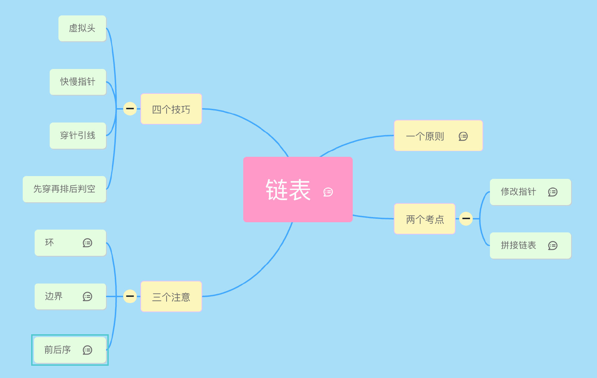

一：分类
算法
数学
数据结构
系统设计

二：数据结构
数组和链表是根本
数组
链表 单/双向链表
队列
堆  最大堆 ／ 最小堆
栈
树  二叉树
图
字符串：前缀树（字典树） ／ 后缀树

三：常用的思想方法
穷举法
动态规划
递推算法
递归
分治算法思想
概率算法思想
回溯法
迭代算法（辗转法）
贪心算法思想
图算法
二分法
DFS & BFS
状态压缩
剪枝

四：基础
基础技巧：分治、二分、贪心
排序算法：快速排序、归并排序、计数排序
搜索算法：回溯、递归、深度优先遍历，广度优先遍历，二叉搜索树等
图论：最短路径、最小生成树
动态规划：背包问题、最长子序列

五：模型
字典树
dp
回溯
前缀和
BFS
位运算
DFS 网格图
单调栈，单调队列
哈希表
二叉树
二叉搜索树
双指针
滑动窗口
数组
二分查找
DFS
链表

栈
堆（优先队列）
字符串
数学
排序
贪心
计数
并查集
分治
有序集合
枚举


1.数组，链表操作

遍历
数组是索引 ++
链表是 cur = cur.next

迭代伪代码：

当前指针 =  头指针
while 当前节点不为空 {
   print(当前节点)
   当前指针 = 当前指针.next
}

一个前序遍历的递归的伪代码：

dfs(cur) {
    if 当前节点为空 return
    print(cur.val)
    return dfs(cur.next)
}

反转：
数组的反转容易，头尾双指针+交换
反转链表：头尾指针+子交换指针+递归
链表是递归的数据结构， 很多链表问题天生具有递归性，比如反转链表，因此仅仅画出一个子结构就可以了

技巧：
（1）虚拟头：这种方式新开辟内存空间，可防止原对象的指针改动
ans = ListNode(1)
ans.next = head
（2）快慢指针：
判断链表是否有环，以及环的入口都是使用快慢指针即可解决。
求链表的交点也是快慢指针
由于链表不支持随机访问，因此如果想要获取数组中间项和倒数第几项等特定元素就需要一些特殊的手段，而这个手段就是快慢指针。
比如要找链表中间项就搞两个指针，一个大步走（一次走两步），一个小步走（一次走一步），这样快指针走到头，慢指针刚好在中间。
如果要求链表倒数第 2 个，那就让快指针先走一步，慢指针再走
（3）穿针引线
比如反转插入另外一个链表中间，需要a,b,c,d四个点
其实 a，d 分别是需要反转的链表部分的前驱和后继（不参与反转），而 b 和 c 是需要反转的部分的头和尾（参与反转）。
因此除了 cur， 多用两个指针 pre 和 next 即可找到 a，b，c，d。
（4）先穿再排后判空
```py
while cur:
    next = cur.next
    if not next: break
    n_next = next.next

```


2：树
二叉树的三种流行的遍历方法，分别是前序遍历，中序遍历和后序遍历
